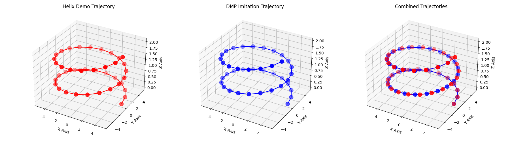
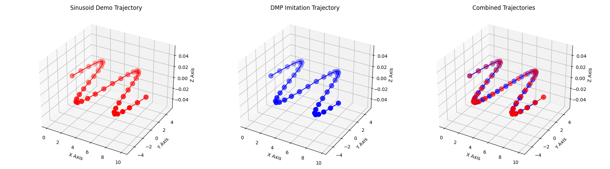
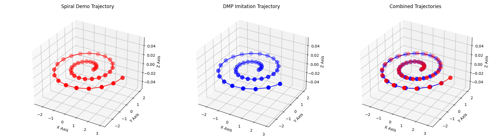
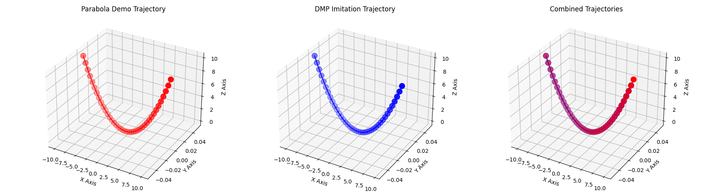
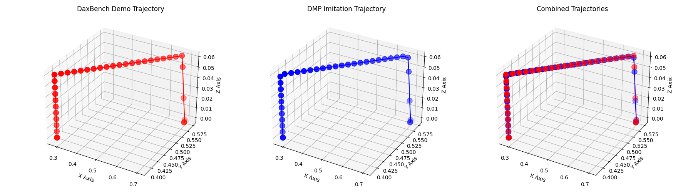
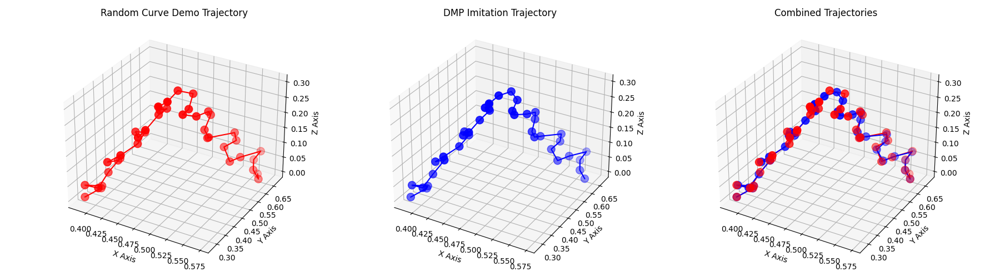
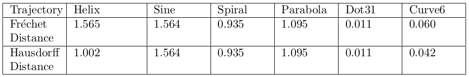

# DaXBench-DMP
We employ DaXBench as a cloth simulator to analyze Deformable Object Manipulation (DOM), and the Dynamic Movement Primitives (DMP) method is applied to generate a series of parameterized trajectories by imitation learning.  The trajectories then are used in DaXBench cloth simulation environment to do folding manipulation.

[1]: https://github.com/straizys/cartesian-dmp                     "cartesian-dmp"

### Major dependencies

- [DaXBench](https://github.com/AdaCompNUS/DaXBench)
- [cartesian-dmp](https://github.com/straizys/cartesian-dmp)

## Part A: Cartesian-DMP
In this part, the DMP algorithms from [cartesian-dmp][1] is choosed and adapted to do imitation learning. We selected 6 different trajectories as demonstrations, which were used in DMP. These 6 trajectories include: helix, sine wave, spiral, parabola, the trajectory of dot_31 during the folding process in DaXBench, and a random curve containing sinusoidal perturbations along the y-direction, with Gaussian noise added to its x,y and z values.

  

  

  

  

  

  

We utilized Fréchet distance and Hausdorff distance as metrics to quantify the difference between the demonstration and its imitation generated by DMP algorithm, and the results are presented in this table:

  

